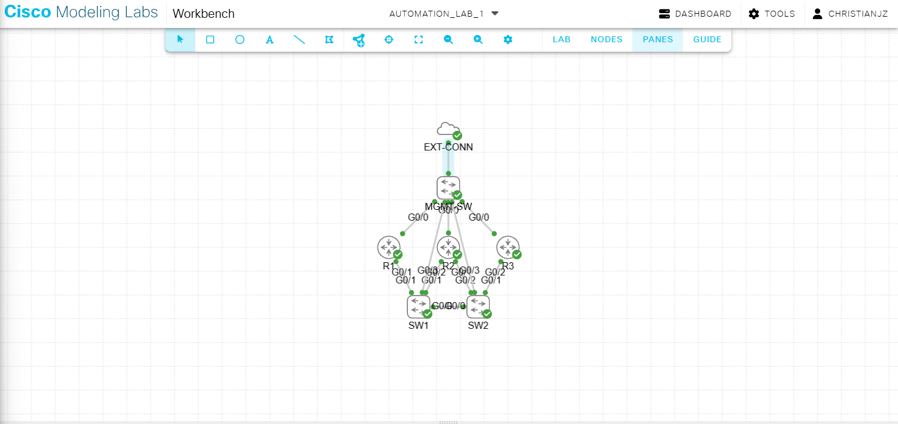
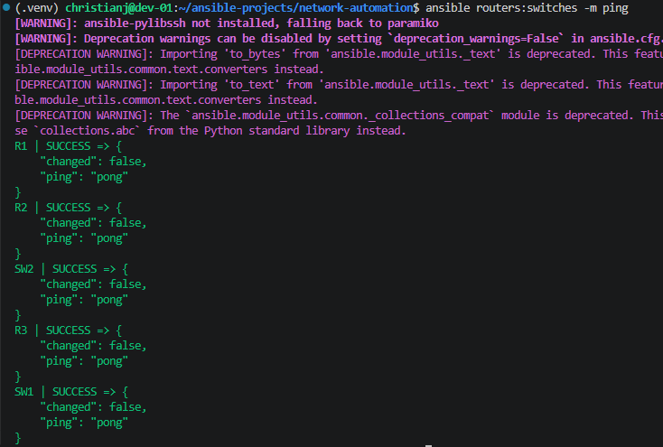
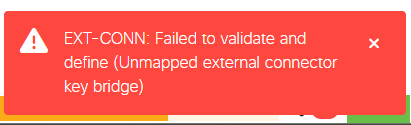
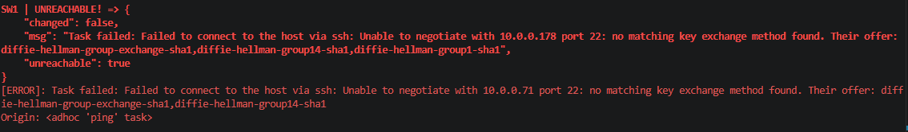

# CML Network Automation Project 1

This project demonstrates a professional CI/CD approach to network infrastructure using Ansible and Cisco Modeling Labs (CML).

## Phase 0: Environment & Connectivity
- **Isolated Environment:** Implemented a Python virtual environment to manage dependencies and avoid system-wide conflicts.
- **Library Integration:** Configured the `virl2_client` and `cisco.cml` Ansible collection.
- **Interpreter Management:** Resolved Python interpreter discovery issues by explicitly mapping the Ansible controller to the virtual environment path.
- **API Verification:** Developed a "Smoke Test" playbook to verify authenticated connectivity to the CML REST API.

## Phase 1: Infrastructure as Code (IaC)
- **Declarative Deployment:** Pivoted from manual node creation to a declarative "Blueprint" approach using a `topology.yaml` file.
- **OOB Management Architecture:** Designed and implemented an **Out-of-Band (OOB) Management Network**.
  - Integrated an **External Connector (Bridge)** to link the virtual lab to the physical development environment.
  - Deployed an **Unmanaged Management Switch** to act as a central hub, overcoming CML's single-link limitation on the External Connector.
- **Schema Validation:** Troubleshot and resolved CML API validation errors regarding mandatory fields (versioning, interface types, and node-to-interface mapping).
- **Topology:** Deployed a 7 -node topology consisting of:
  - 3x Cisco IOSv Routers
  - 2x Cisco IOSvL2 Switches
  - 1x Unmanaged Management Switch
  - 1x External Connector

## Current Project State
The virtual hardware and management plane are fully deployed and verified. The environment is now reachable via the OOB management network, ready for Phase 2: Configuration Management.

## Issue Tracker
- Ran into issue with external connector not wanting to come online and getting the following error. (**Fixed** had external connector set as null bridge when it needed to be System Bridge.)

- Ran into SSH error with ansible doing a test ping. (**Fixed** was caused by an incorrect indention in my inventory.yml file.)
 

## Ansible Commands
- `ansible routers:switches -m ping --ask-vault-pass -vvv` Ping select children in inventory file. -m module name, --ask-vault-pass allow command to reach var.yml file encypted with ansible vault. -vvv verbose output.
- `ansible-playbook "playbook name"` Run ansible playbook.
- `ansible-playbook --flush-cache` Clear the socket.
- 
